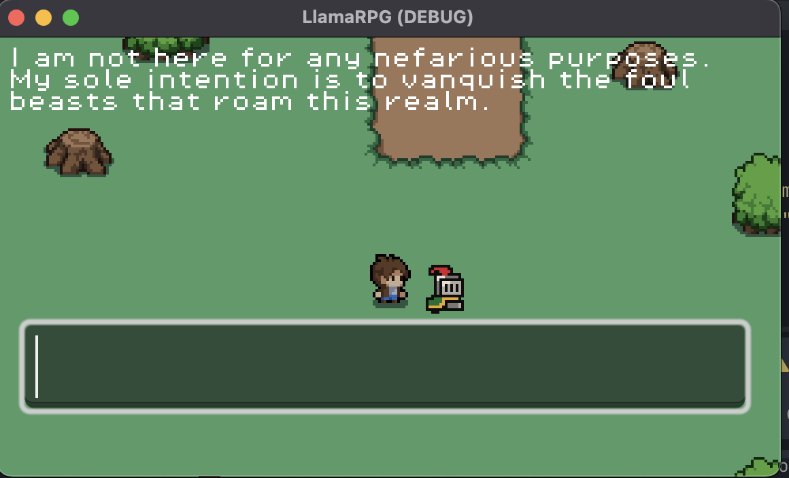

# OllamaRPG
A fun project using Ollama and Godot. Developed on MacOs, not tested on Windows or Linux.

## Installation

You will need the following to run this project:
- Godot 4.2.x
- espeak 
- [Ollama](https://ollama.com/download/mac)

You can install espeak on the Mac using Brew:
`brew install espeak`

## Ollama

When using Ollama, don't forget to pull the model you want to use
`ollama pull llama3`

Currently, the following models are supported:
- `llama3`
- `llama2`
- `command-r`

## OpenAI

If you want to use any of the OpenAI models, you need to rename the `sample.config.cfg` file to `config.cfg`, and place your API key in this file.

The following OpenAI models are supported:
- `OpenAI GPT-4o`
- `OpenAI GPT-4`
- `OpenAI GPT-4-turbo` 
- `OpenAI GPT-3.5-turbo-0125`

## Text to Speech
The following TTS modules are supported:
- `ESpeak`
- `Eleven Labs`

To use `Eleven Labs`, you can enable it in the inspector. Make sure to set the following variables in the `config.cfg` file:
`ELEVEN_LABS_API_KEY`
`ELEVEN_LABS_VOICE_ID`

## Interaction

You can control the main player character, George, by using keyboard arrows or WASD keys. You can move George around in the game world, and have him discover items or NPCs. You can also talk to George by typing questions in the search box. You can ask George where he is, what he's doing and why. You can also ask George to walk somewhere by giving a location, or by asking him to walk to a previously discovered place or item.

Currently, George understands the following commands:
- Move / Walk somewhere. You can ask George to move / walk/ run in any direction. He understands North, East, South and West, and should also understand up, left, right and down
- Open. George can open and close chests in the world. They are currently still empty though

Sometimes George will get scared if he finds a monster. When this happens, George might decide to run away to safety, and will normally run to his bed, assuming of course that he's already found his bed and knows where it is!

